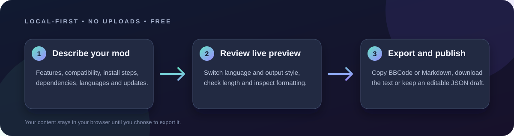

# Workshop Page Studio

**Draft polished game-mod pages offline.** Fill in a simple form, preview the result live, then copy or download Steam BBCode or Markdown. Drafts stay in your browser unless you export them yourself.

**[Open the live app](https://ghostnever-lkm.github.io/workshop-page-studio/)** · [Download v0.1.0 for offline use](https://github.com/GhosTnever-lkm/workshop-page-studio/releases/latest/download/Workshop-Page-Studio-v0.1.0.zip) · [Browse source files](index.html)

Workshop Page Studio is a free, static web app for mod authors. It has no account, backend, analytics, external fonts, or third-party scripts.

## Features

- Russian and English interface.
- Structured fields for a mod summary, description, features, compatibility, installation, dependencies, languages, changelog, and links.
- Live preview and character count. Counts are informational; platform limits can change.
- Export as Steam BBCode or Markdown, copy to clipboard, or download a text file.
- Save a draft as JSON and load it later on your device.
- Responsive layout and keyboard-accessible controls.

## Use it

Open [`index.html`](index.html) in a recent browser. It works locally without a server and can be used offline after download.

1. Choose the language and output format.
2. Fill in the mod details or load the example.
3. Review the live preview and character count.
4. Copy the result, download a text file, or save the editable form as JSON.

## Privacy

The app has no network code. Your draft remains in the page until you export it or close the tab. Copying uses the browser clipboard permission when available.

## Limits

The exporter provides common Steam-style BBCode and standard Markdown. It does not submit content to Steam, validate platform-specific policy, reserve a workshop title, or guarantee that every target platform accepts every formatting tag. Review the output on the destination site before publishing.

## Support / Pro Version

This project is free and open source; there is no paid Pro version yet. You can support development through [Buy Me a Coffee](https://buymeacoffee.com/azizazimov8), [Boosty](https://boosty.to/azizazimov), or [GitHub Sponsors](https://github.com/sponsors/GhosTnever-lkm).

| Network | Asset standard | Public receive address |
|---|---|---|
| Bitcoin | BTC | `bc1qn75pj4n7gyl2k5kf2f97elvyenz52q6nn2g30u` |
| Tron | TRC-20 | `TCBSy38X57hA6w2onJcxom24x1febc1mP1` |
| BNB Smart Chain | BEP-20 | `0xD431a917961E0b086B96D9F72b5C8fF19b19068a` |

Send assets only on the matching network. Never share a seed phrase or private key.

## License

MIT. See [LICENSE](LICENSE).
